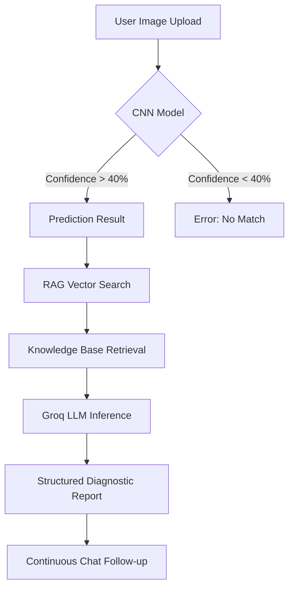

# 🌿 PhytoScan — AI-Powered Plant Disease Detection

PhytoScan is a state-of-the-art plant pathology assistant that combines **Convolutional Neural Networks (CNN)**, **Retrieval-Augmented Generation (RAG)**, and **Large Language Models (LLMs)** to provide instant, precise diagnostics and personalized treatment protocols for 38 different plant diseases.

---

## 🛠 System Architecture

The project is built on a multi-stage AI pipeline designed for high accuracy and contextual depth.

### 1. Diagnostic Engine (CNN)
- **Model**: Custom CNN architecture trained on the PlantVillage dataset.
- **Scope**: Supports 38 classes across plants like Apple, Tomato, Corn, Potato, Grape, etc.
- **Safety**: Confidence thresholding (40%+) to prevent misdiagnosis on non-leaf images.

### 2. Knowledge Layer (RAG)
- **Vector Store**: FAISS (Facebook AI Similarity Search) for high-speed semantic retrieval.
- **Embeddings**: `sentence-transformers/all-MiniLM-L6-v2`.
- **Database**: Local knowledge base (`data/knowledge_base.txt`) containing specific pathology, symptoms, and localized treatment actions.

### 3. Intelligence Layer (LLM)
- **Engine**: Groq (Llama 3 70B) for ultra-fast inference.
- **Logic**: Combines CNN predictions with RAG-retrieved data to generate a structured, human-readable report.

---

## 📊 System Design Flow



---

## 🚀 Deployment (Render/Local)

### Prerequisites
- Python 3.10+
- Groq API Key (in `.env`)
- Git LFS (for the `.pth` model file)

### Installation
```bash
git clone https://github.com/Ashutosh-AIBOT/plant-disease-detection-cnn.git
cd plant-disease-detection-cnn
pip install -r requirements.txt
```

### Running the App
```bash
streamlit run App.py
```

---

## 📂 Project Structure
- `App.py`: Main Chatbot interface with RAG integration.
- `app01.py`: Premium Dashboard interface.
- `plant_disease_cnn.pth`: The primary detection model (managed via Git LFS).
- `data/`: Contains the knowledge base and vector store.
- `utils/`: Core logic for model loading and RAG retrieval.

---

## 👨‍💻 Author
**Ashutosh-AIBOT**

---

> [!IMPORTANT]
> This tool is for educational and advisory purposes. Always consult local agricultural experts for large-scale crop treatments.
